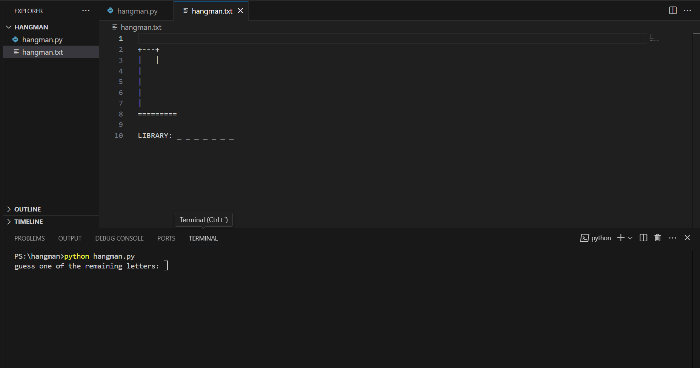

# Python Hangman

This project is an extension to classic hangman. Here you have to guess a random python library choosen by the program instead of some unkown random word. This game improves your knowledge about the python libraries.

## How to play

1. clone this repo using following command

```shell
git clone github.com/varunpenumudi/python-projects.git
```

2. cd into python-projects/python-hangman folder

```shell
cd python-projects/python-hangman
```

3. run the file `hangman.py` in the folder.

```shell
python hangman.py
```

4. open the hangman.txt to view the hangman as you guess the letters.

## Rules

when you start the game an empty hanger without hangman is shown in the hangman.txt file(you have to open it once you run the code). Along with this the _ will be shown for each letter in library name. You have to start guessing the letters in that library name.



While playing if you guess the letter that is not in the word then hangam continues to create otherwise if you guessed a correct letter of the word. The guessed letter at it's position in the word is shown instead of "_" in the library


Finally if the hangman is created before you guess all the letters in the library name, YOU LOST the game.


If you guessed all the letters correctly before the hangman is fully created, YOU WON the game.


