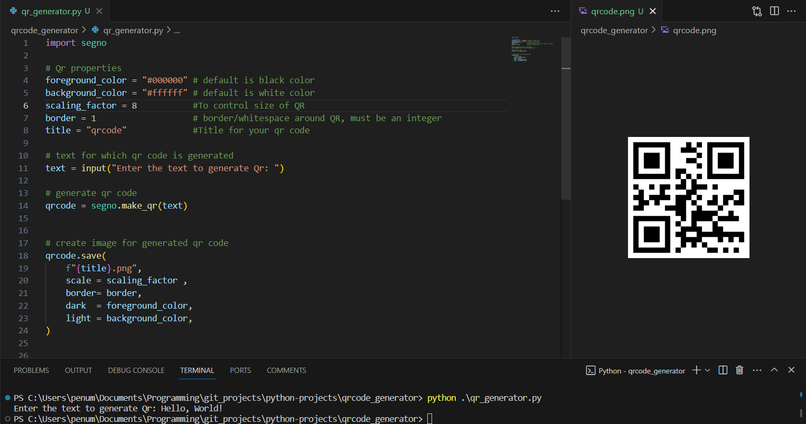

# QR generator
## Description
This project can generate a qr code for any text you give. You can change the color, size, border of the qrcode using this project. This makes easy to generate qr code that you would need for various purposes .


## About Project
This project is made with segno library in python. Segno is a library that helops to generate qr codes for any kind of text you can give as  input. you can create qr codes in different sizes and colors using this library.

## Difficulty Level
### Easy: ⭐⭐

## Usage
1. Before using this project, ensure that the segno library is installed on your system. If not installed, run the following command in your terminal:
```
python -m pip install segno
```
2. Next, clone this repository onto your system using the git clone command. Navigate into the qr-generator folder within the repository folder.
3. Run the qr-generator.py file in that folder. You will be prompted to enter text for generating the QR code. Provide the text to generate the QR code.
4. The QR code file will be generated in the project folder with a filename in the form <title>.png. The default value of the title is "qrcode", and you can change it in the QR properties.
5. You can change title, color, size and border padding of this qr by changing the variable values at the top of project file.
